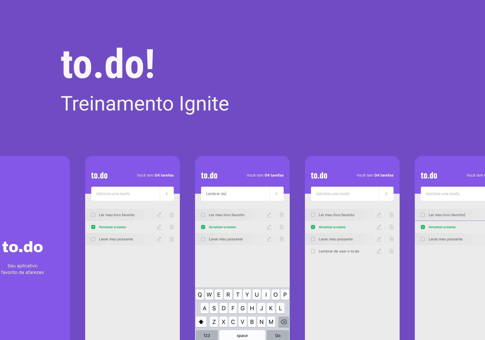

<p align="center">
  

 
</p>





## 💻 Projeto
to.do é um App para anotar, editar e deletar tarefas.


## :hammer_and_wrench: Features 

em construção...


## ✨ Tecnologias

-   [ ] React Native
-   [ ] Typescript

## Executando o projeto

Utilize o **yarn** ou o **npm install** para instalar as dependências do projeto.
Em seguida, inicie o projeto.

```cl
yarn start
```
(se estiver no Linux e for rodar no android)
```cl
yarn android
```

## 📄 Licença

Esse projeto está sob a licença MIT. Veja o arquivo [LICENSE](LICENSE.md) para mais detalhes.

<br />

<div align="center">
  <small>Desenvolvido por Thiago Silva</small>

  [](https://www.linkedin.com/in/thiago-furtado-silva/) 
</div>